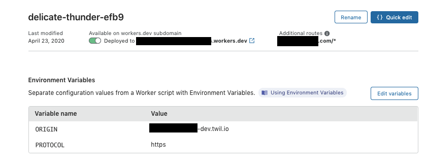

# twilio-videoapp-cf-worker-proxy
Caching Serverless Proxy for Serverless Functions using Cloudflare Worker

You can use this to use your own custom domain with Serverless Function

It also provides caching which can be nifty if you are using Serverless Assets

Example using Serverless Video App

1) Setup you Serverelss Function (I'm using Twilio's free Video App here)

https://www.twilio.com/blog/open-source-video-apps-reactjs-ios-android

2) Setup up your a Cloudflare Worker

Envrionment Variables
- ORIGIN: hostname of external host
- PROTOCOL: https or http

Copy the code from index.js into a new worker. This can be done using the Cloudflare GUI or using Wrangler.

3) Add a route to your worker so that it can answer requests on your domain hosted on cloudflare

[Route](images/route.png)

4) As long as the proxy status of the subdomain or domain is set to "Proxied" using cloudflare, the worker will respond to all requests and proxy them to your Serverless Functions & Assets. Cloudflare will also serve as a super-fast georedundant CDN for your assets.

5) Use your function with your own domain

[VideoApp])(images/videoapp.png)